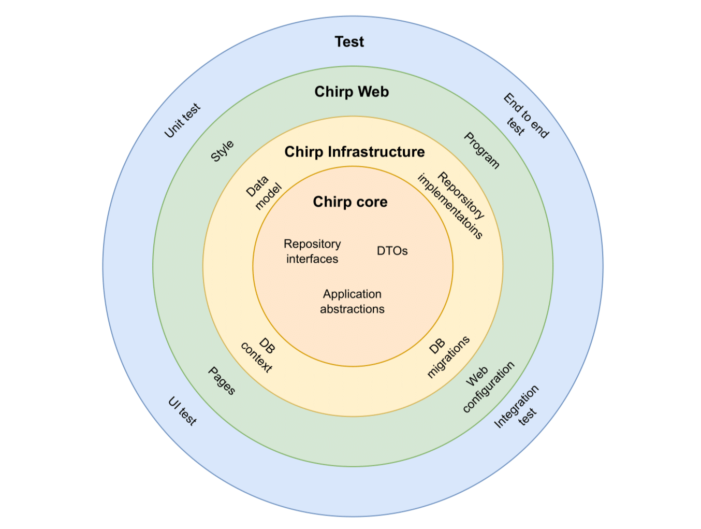
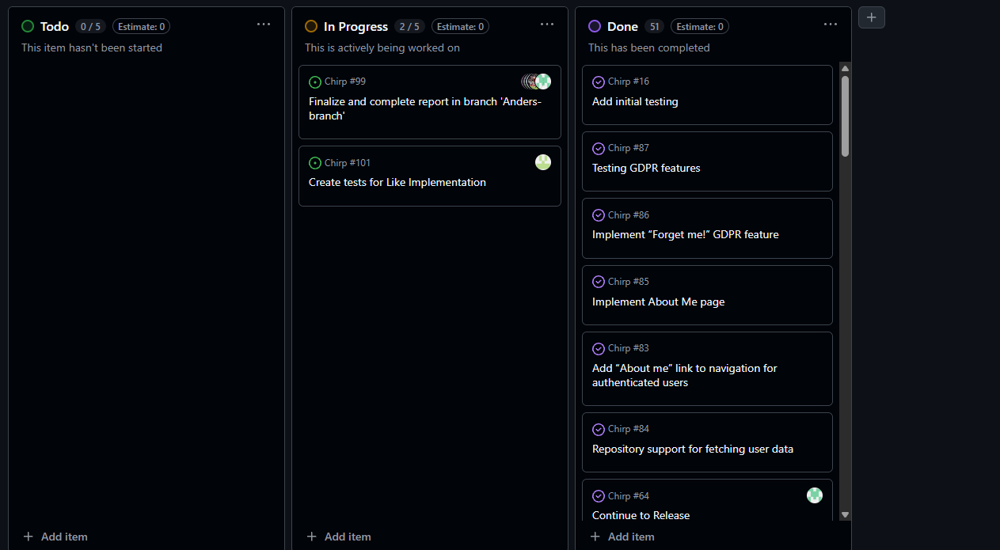

<div align="center">

# Chirp! Project Report

**ITU BSANDSA1KU 2025/2026 — Group 23**

<br/>

<table>
  <tr>
    <td align="left">
      Anders Grangaard Jensen<br/>
      <a href="mailto:agje@itu.dk">agje@itu.dk</a>
    </td>
    <td align="left">
      Mads Christian Ørskov Koldnborg<br/>
      <a href="mailto:mcko@itu.dk">mcko@itu.dk</a>
    </td>
  </tr>
  <tr>
    <td align="left">
      Mathias Vestergaard Djurhuus<br/>
      <a href="mailto:mavd@itu.dk">mavd@itu.dk</a>
    </td>
    <td align="left">
      Rasmus Tornvig Nordquist<br/>
      <a href="mailto:ratn@itu.dk">ratn@itu.dk</a>
    </td>
  </tr>
  <tr>
    <td align="left">
      Theodor Monberg<br/>
      <a href="mailto:tmon@itu.dk">tmon@itu.dk</a>
    </td>
    <td></td>
  </tr>
</table>

</div>

---

# Introduction
Chirp! is a microblogging web application where users can post short messages ("cheeps") and interact with other users through following and liking. The goal of the project is to design and implement a maintainable ASP.NET Core application with authentication, persistence, Automated testing, and CI pipeline.

Unauthenticated users can view the public timeline. After logging in, users can create cheeps, follow and unfollow other authors, like cheeps, unlike cheeps, and view personalized timelines such as (About me, FollowingTimeline, and Mypage). Chirp! is built using ASP.NET Core Razor Pages, Entity Framework Core, and ASP.NET Identity with a relational database backend 

Out of scope: DMs and media uploads.

# Design and architecture
## Domain model

The following domain model captures the main entities and relationships in Chirp!.

{ width=100% }

The domain model consists of **Author** and **Cheep**.  
**Author** represents a user in the system and is integrated with ASP.NET Identity. An author can create multiple cheeps, and each cheep belongs to exactly one author.

Authors can follow other authors, forming a many-to-many relationship. A cheep contains textual content and a timestamp.

All entities are persisted using Entity Framework Core via **ChatDBContext**.

## Architecture — In the small

The following diagram illustrates the organization of the code base and its project dependencies.

{ width=100% }

{ width=100% }

The application follows an **onion architecture**.

- The **application (center) layer** is represented by service and DTO abstractions defined in **Chirp.Core**.
- The **domain logic** is centered around the **Author** and **Cheep** entities.
- The **infrastructure (Second) layer** is implemented in **Chirp.Infrastructure** and contains repository implementations, database context, migrations, and ASP.NET Identity integration.
- The **presentation (Third) layer** is implemented in **Chirp.Web** and contains Razor Pages, page models, and authentication endpoints.
- The **test (Fourth) layer** is the last and this is where tests are located. The test suite includes Unit-, UI, Integration and end-to-end tests. This layer depend on all other layers.

Dependencies point inward toward the core and domain layers.

## Architecture of deployed application

The following diagram shows how the deployed Chirp! system is composed and how components communicate.

{ width=100% }

Chirp! is implemented as a client-server web application.

The client is a web browser that renders Razor Pages generated by the server. The server is an ASP.NET Core application built from **Chirp.Web** and deployed using GitHub Actions.

The server communicates with a relational database using SQLite through **ChatDBContext** and Entity Framework Core. All communication between client and server is performed over HTTPS requests.

## User activities

The purpose for this section is to present some core interactions from both  unauthenticated and authenticated users. an UML activity diagram is used to visualize the states triggered by a user’s actions.

The following activity diagram illustrates a typical user journey through Chirp!.

{ width=100% }

An unauthenticated user is presented with the public timeline rendered by **Public.cshtml**. Unauthenticated users can view cheeps but cannot post cheeps or follow other users.

The user can authenticate using ASP.NET Identity login functionality. After authentication, which allows authentication via email or GitHub. After authentication, users have four primary actions: posting cheeps, following other authors, liking cheeps, and deleting their account via the “Forget Me” option on the About Me page. Authenticated users also gain access to personalized timelines such as About Me, FollowingTimeline, and MyPage.

Authenticated users can log out at any time.

## Sequence of functionality/calls through Chirp!

The following sequence diagram shows the flow of an unauthenticated request to the root endpoint and the data retrieval required to render the page.

{ width=100% }

The sequence starts with an HTTP GET request to the root endpoint by a non-authenticated user.

The request is handled by a Razor Page in **Chirp.Web**. The page model invokes repository methods through application-level abstractions. **CheepRepository** retrieves cheep data from the database via **ChatDBContext**.

The retrieved data is mapped to DTOs and returned to the Razor Page. The Razor Page renders the HTML response, which is sent back to the client browser.

# Process
## Build, test, release, and deployment

{ width=100% }

Our GitHub Actions workflow “Build & Deploy — bdsagroup23chirprazor2025” is triggered on pushes to `main`, and can also be started manually via `workflow_dispatch`.  
The `build` job checks out the repository, installs .NET SDK 8.0.415, restores and builds `src/Chirp.Web/Chirp.Web.csproj` in Release for `net8.0`, runs the automated test suite, publishes the application, and uploads the publish output as the `dotnet-app` artifact.  
The `deploy` job downloads the artifact and deploys it to Azure App Service using `azure/webapps-deploy@v3` with the app name `bdsagroup23chirprazor2025` in the `Production` environment.  

After a successful deployment, the `release` job creates a GitHub Release using `softprops/action-gh-release@v1` with the tag `deploy-${{ github.run_number }}` and metadata referencing the commit SHA and branch.

## Team work

{ width=100% }

The project board reflects the state of development immediately before hand-in. A small number of tasks remain unresolved, primarily related to optional features and UI polish. All required functionality for the Chirp! application is implemented.

Development starts with the creation of an issue describing a task. A feature branch is created from `main`. The feature is implemented and tested locally. A pull request is opened and reviewed. After approval, the changes are merged into the `main` branch.

We used pair working for complex tasks and areas with higher risk for example in our integration of authentication. We typically worked in a "Driver" / "Navigator setup and rotated roles to spread knowledge across the team. These pair sessions helped align coding style and architecture design and reduced rework during code review, because design discussions happened before we implemented it.

We held weekly sync meetings to align on progress and priorities. in each meeting we:
- Reviewed what was completed since the last sync (features, bugs, PRs merged)
- Identified blockers and assigned owners to resolve them
- Agreed on the next set of tasks and updated the project board accordingly


## How to make Chirp! work locally
In order to get the chirp! project up and running locally, Follow the steps below:


1. clone repository from GitHub.

The project is built using .NET 8.0, so the .NET8.0 SDK needs to be installed on your machine. 

run git clone https://github.com/ITU-BDSA2025-GROUP23/Chirp.git or your preferred way of cloning a repository.

Then run cd Chirp to navigate into the project folder

(Dependencies are restored using dotnet restore. The database is initialized using EntityFramework Core migrations. )

2. Set environment variables

The project uses OAuth for authentication, and to make it work you need to environment variables - setup GitHub client ID and client secret .

To set up use credentials dotnet user.secrets run these commands to configure the environment variables:

```bash

dotnet user-secrets init

dotnet user-secrets set "authentication_github_clientId" "<your-github-oauth-client-id>"

dotnet user-secrets set "authentication_github_clientSecret" "<your-github-oauth-client-secret>"
```

3. Run the project

TThe application is started using the dotnet run command
from the Chirp.Web project.

if you are not inside the src/Chirp.Web folder, you can run: dotnet run --project src/Chirp.Web

The application is accessible in a web browser on the configured local port(default is: http://localhost:5273).


## How to run test suite locally

To run the test suite locally, execute the following command from the root of the repository:

```bash
dotnet test
```

The test suite includes:
- **Unit tests**: Testing individual components in isolation (e.g., repository methods).
- **Integration tests**: Testing the interaction between multiple components and the database.
- **UI/End-to-End tests**: Testing the application from a user's perspective.

# Ethics
## License

The application is released under the MIT License. 

The MIT License allows unrestricted use, which encourages adoption and reuse. Its simplicity lowers barriers for others to build upon the software while still requiring attribution on the original authors. However, it has notable drawbacks. Modified or improved versions do not have to be shared publicly, which can limit contributions back to the open-source community. In addition, the license provides no warranty or liability, meaning the software is offered "as is." This protects the authors but places all risk on the users. Despite these downsides, the benefits outweigh the limitations, making the MIT License a suitable choice for our application.

## LLMs, ChatGPT, CoPilot, and others

ChatGPT was used during development as a support tool. It was primarily used for explanations, code suggestions, and assistance with documentation.

All generated content was reviewed and adapted manually. Overall, the use of LLMs reduced development time without replacing developer judgment.
